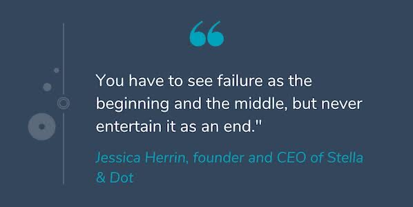

<h1 align="center">
 
</h1>
<h1 align="center">Hi 👋😄, I'm Daiyan Kabir   </h1>
<h3 align="center">I am a Software Developer.</h3>

  

  

- 🌱 I’m currently learning **ASP.NET, VUE js, Django

- 📫 How to reach me **kabirdaiyan@gmail.com**

<h3 align="left">Connect with me:</h3>

&nbsp
&nbsp
<!-- &nbsp -->

<!-- <h3 align="left">Languages and Tools:</h3>

 &nbsp  &nbsp&nbsp &nbsp &nbsp &nbsp &nbsp &nbsp  &nbsp&nbsp  &nbsp&nbsp &nbsp &nbsp &nbsp &nbsp &nbsp &nbsp &nbsp &nbsp &nbsp &nbsp  &nbsp &nbsp &nbsp &nbsp &nbsp 
 -->

 
 
<!-- 

&nbsp;
 -->

   <table>
      <tr>
       <th>Profile stats  </th>
       <th>Language Contribution</th>
     </tr>
      <tr>
       <td> </td>
       <td> </td>
     </tr>
   </table>

